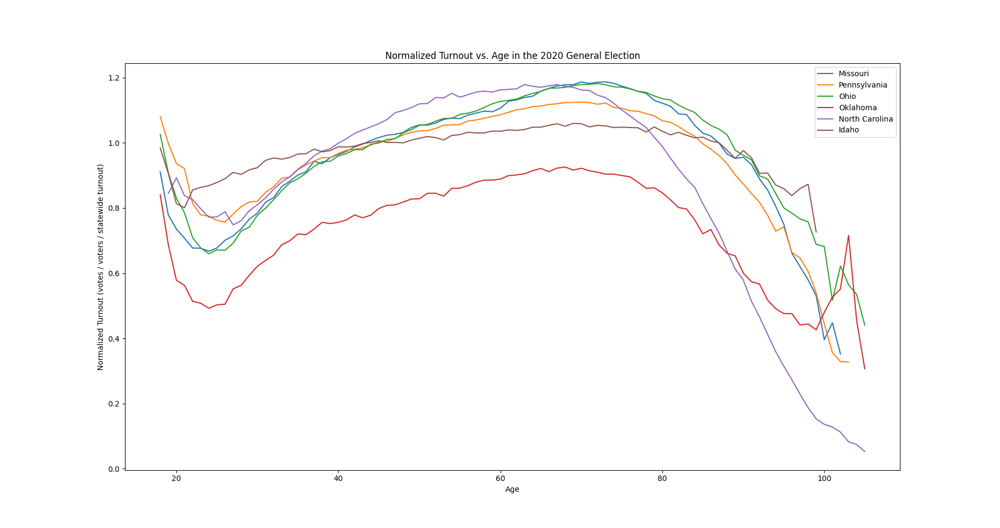

Normalized turnout vs. age curves generated by other repos for various states (e.g. election-fraud-pennsylvania, election-fraud-missouri) are plotted together to show how they differ across state lines, but are consistent among counties within the same state. These curves should not differ significantly.

